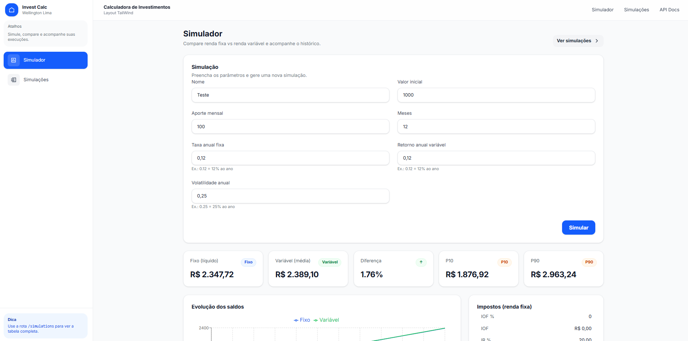
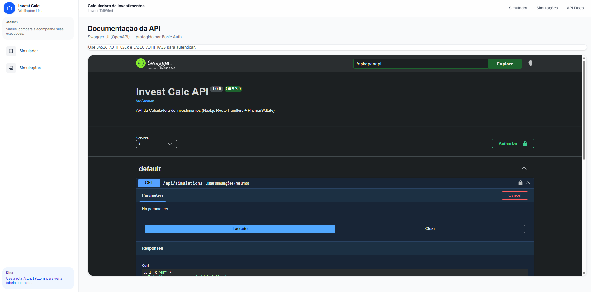
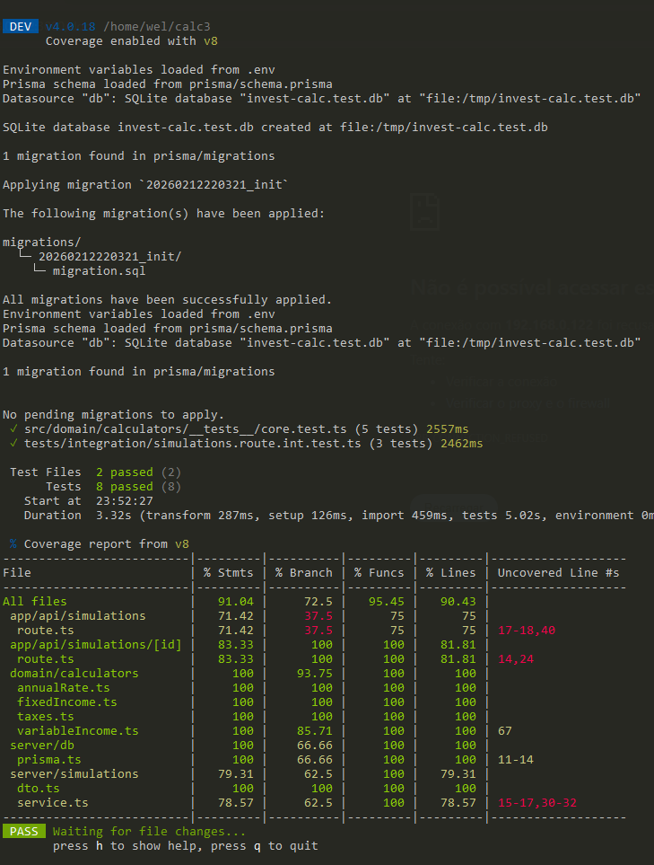

# Calculadora de Investimentos — Next.js + Route Handlers + SQLite (Prisma)



Projeto de simulação e comparação entre **Renda Fixa** e **Renda Variável**, com persistência local (SQLite) e backend embutido no Next.js via Route Handlers.

## Stack
- Next.js (App Router) + TypeScript + Tailwind
- Route Handlers (`/app/api/**`)
- SQLite local via Prisma (migrations versionadas)
- Zod (validação)
- Vitest (testes unitários do core)
- Recharts (gráficos)

## Arquitetura
- `src/domain/**`: cálculos e regras (funções puras e testáveis)
- `src/server/**`: Prisma + services + repos (server-only)
- `src/app/api/**`: endpoints (Route Handlers)
- `src/app/**` e `src/components/**`: UI

## Como rodar
```bash
npm i
npx prisma migrate dev --name init
npm run dev
npm run test
```

Crie `.env`:
```env
DATABASE_URL="file:./dev.db"

# Auth (simples)
BASIC_AUTH_USER="admin"
BASIC_AUTH_PASS="admin"

# (opcional) Docker
DATABASE_URL_DOCKER="file:./data/dev.db"
```

## Autenticação (simples)
O app e a API são protegidos com **HTTP Basic Auth** via `src/middleware.ts`.

- Usuário/senha vêm de `BASIC_AUTH_USER` e `BASIC_AUTH_PASS`.
- Defaults: `admin/admin`.


## Swagger (OpenAPI)
- OpenAPI JSON: `GET /api/openapi`
- Swagger UI: `GET /docs`



## Testes de integração
Além dos testes unitários do core (`src/domain/**`), há testes de integração para as rotas:



```bash
npm run test
```

Arquivos:
- `tests/integration/simulations.route.int.test.ts`
- `tests/setup.ts` (cria DB de testes e aplica migrations)

## Docker / Docker Compose
Build e execução em container:

```bash
docker compose up --build
```

Notas:
- O SQLite é persistido em um volume (`/app/data/dev.db`).
- A inicialização roda `prisma migrate deploy` automaticamente (`scripts/docker-entrypoint.sh`).

## API
### POST /api/simulations (idempotente)
Header obrigatório:
- `Idempotency-Key: <uuid>`

Respostas:
- 201: criou novo
- 200: replay idempotente (mesma key + mesmo payload)
- 409: mesma key com payload diferente

### GET /api/simulations
Lista histórico

### GET /api/simulations/:id
Detalhe

### DELETE /api/simulations/:id
Exclui

## Premissas e regras
### Anual → mensal
`rm = (1 + taxaAnual)^(1/12) - 1`

### Renda fixa
Juros compostos com aporte mensal, série mês a mês.

### Impostos (renda fixa)
Premissa de dias: `days = months * 30`  
IOF regressivo (1..30 dias) e IR por faixa.
Ordem: **IOF sobre rendimento bruto → IR sobre (rendimento - IOF)**.

### Renda variável (Monte Carlo)
Monte Carlo com distribuição Normal mensal:
- `retMensal = (1 + retAnual)^(1/12) - 1`
- `volMensal = volAnual / sqrt(12)`
Seed determinístico para reprodutibilidade.
Diferencial: P10/P90.

## Idempotência (Idempotent SQLite operations)
Para evitar duplicidade no POST, foi implementada idempotência baseada em:
- Header `Idempotency-Key`
- Tabela `IdempotencyKey` com `key UNIQUE` e `requestHash`
- Mesma key + payload igual => retorna o mesmo resultado
- Mesma key + payload diferente => 409 Conflict

## Diferenciais
- Idempotência no POST com constraints no SQLite/Prisma
- Monte Carlo seed determinístico
- P10/P90 (risco)
- Persistência completa (inputs + outputs)
- Core isolado + testes Vitest

## Ferramentas de IA/LLM utilizadas
- **ChatGPT (Copilot Chat / ChatGPT-4.1)**: usado para acelerar a definição de arquitetura, geração dos módulos de domínio (cálculos), implementação da idempotência e estruturação dos testes unitários.
- **GitHub Copilot**: usado como assistente inline para boilerplate (DTOs, repositories, componentes UI) e refactors.

⚠️ **OBRIGATÓRIO:** os prompts utilizados estão listados abaixo e devem ser enviados junto com o projeto.

## PROMPTS de IA utilizados (OBRIGATÓRIO)

### Prompt 1 — Prisma + SQLite + schema + IdempotencyKey
Configure Prisma com SQLite no Next.js App Router:
- `.env` com DATABASE_URL=file:./dev.db
- `prisma/schema.prisma` com models Simulation, SimulationResult e IdempotencyKey (key UNIQUE, requestHash, simulationId UNIQUE)
- `src/server/db/prisma.ts` singleton
- scripts no package.json: prisma:generate, prisma:migrate, prisma:studio

### Prompt 2 — Domínio (annualRate + fixedIncome + taxes + variableIncome)
Implemente em `src/domain/**`:
- annualToMonthlyRate
- simulateFixedIncome (série mensal)
- getIofPercent, getIrRate, applyFixedIncomeTaxes (IOF antes do IR)
- simulateVariableIncome Monte Carlo (Normal Box-Muller) com seed determinístico (LCG), retornando média e P10/P90
Exporte tudo em `src/domain/calculators/index.ts`.

### Prompt 3 — Service idempotente (transaction + sha256)
Crie `src/server/simulations/service.ts`:
- Ler header Idempotency-Key
- Calcular requestHash (sha256 do payload)
- Em transaction:
	- Se key existe e hash bate => replay (200) retornando registro existente
	- Se key existe e hash diferente => 409 Conflict
	- Se key não existe => criar simulation + result + registrar idempotencyKey
Persistir series/taxes/meta como JSON string.

### Prompt 4 — Route Handlers (CRUD + status codes)
Implemente:
- `src/app/api/simulations/route.ts` (POST idempotente e GET list)
- `src/app/api/simulations/[id]/route.ts` (GET detail e DELETE)
Retornar 201/200/409/404/204 corretamente e padronizar `{ success, data }`.

### Prompt 5 — UI (form + resultados + gráfico + histórico)
Implemente:
- Form que gera uuid para Idempotency-Key e previne double submit
- Cards (fixedNet, variableMean, diff%)
- TaxesTable (IOF/IR)
- Chart (fixo vs variável) e exibir P10/P90
- Páginas `/`, `/simulations`, `/simulations/[id]`

### Prompt 6 — Vitest (core financeiro)
Configure Vitest e crie testes:
- annualToMonthlyRate
- taxes (iof/ir/apply) com exemplo numérico validando ordem IOF→IR
- fixedIncome
- variableIncome determinístico por seed + validação P10 <= mean <= P90
Scripts: test, test:watch, coverage
